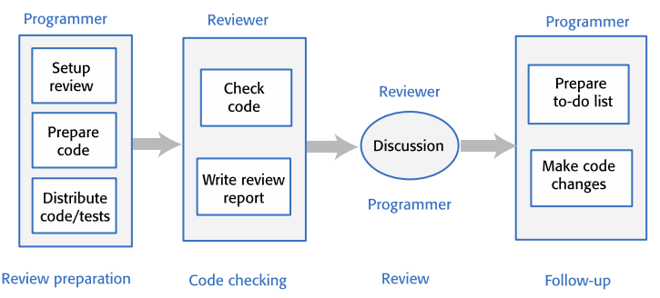
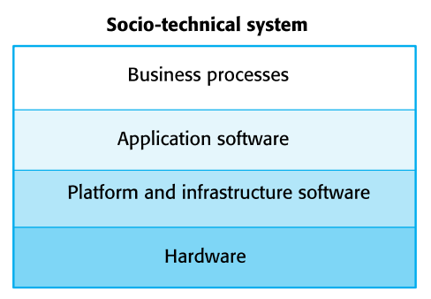

# TEÓRICA 9: Testagem de Software

Testagem de ‘software’ é o processo onde o programa nós executamos o programa com dados que simulam as entradas de um
utilizador comum. Após isso, observamos o comportamento para ver se o nosso programa faz o suposto.

- Caso passe nos testes, o programa está correto.
- Caso não passe, estamos de encontro com um 'bug'.

## Tipos de bugs

Existe dois tipos:

- Erros de programação: existem erros na implementação do pedido;
- Erros de compreensão: existe uma certa dificuldade em entender o pedido, ou desconhece alguns detalhes daquilo que ele
  é suposto fazer;

## Tipos de testes

Existem quatro tipos comuns de teste:

- Teste funcional:
    - Teste de sistema;
    - Teste de ferramentas;
- Teste de utilizador;
- Teste de performance;
- Teste de segurança;

## Automatação de testagem

** Fig.1: Diagrama de automatação de testagem **

Normalmente organiza-se a automatação de testes em três partes:

- Organização de testes;
- Execução de testes;
- Análise de resultados;

Nota: Na automatação de testes, a testagem de ferramentas e feita diretamente na API e não na ‘interface’ gráfica.

## Desenvolvimento guiado por testes

Desenvolvimento guiado por testes ou (Test Driven Development) é um processo de desenvolvimento de ‘software’ onde os
testes são escritos antes do código. O objetivo é escrever testes que falhem, e depois escrever o código para que os
testes passem.

Benefícios:

- Aumenta a confiança no código;
- Aumenta a qualidade do código;
- ‘Debugging’ mais fácil;

Desvantagens:

- Os programados ficam mais focados em passar nos testes do que em escrever código de qualidade e a estrutura do mesmo;

## Testes de segurança

Testes de segurança visam encontrar vulnerabilidades no ‘software’ que possam ser exploradas por um atacante.

### Testes de segurança baseados em risco

Testes de segurança baseados em risco (ou Risk Based Testing) é um processo onde os testes são baseados no risco de uma
aplicação.

#### Exemplos

Alguns exemplos são:

- Portas HTTP inutilizadas, porém abertas;
- Falhas de autenticação;
- ‘Cookies’ de acesso são revelados para um potencial atacante;
- Chaves de encriptação divulgadas para um potencial atacante;

## Revisões de código

Revisões de código envolvem uma ou mais pessoas que analisam o código de um programa para encontrar possiveís problemas.
Caso sejam encontrados erros, será responsabilidade do **desenvolvedor** resolvê-lo.

** Fig.2: Diagrama de revisão de código **

# TEÓRICA 10: Evolução de Software

Alterações no ‘software’ são inevitáveis poís são parte do processo de evolução e melhoria do mesmo. O problema chave
encontra-se na gestão dessas mudanças nos sistemas existentes.

A evolução é importante pois:

- Erros devem ser reparados;
- Ambiente de trabalho é alterado constantemente;
- O desempenho e/ou fiabilidade do 'software' pode ser melhorada;
- Maior parte das empresas está mais virada para uma evolução do ‘software’ existente, do que o desenvolvimento de um
  novo.

Existem três estados no ciclo de vida de um sistema de ‘software’ após o seu desenvolvimento:

- Evolução: Neste estado ele encontra-se operacional ainda, porém novos requisitos para ser implementados são
  propóstos;
- Manutenção: Neste estado o sistema encontra-se operacional, porém não há novos requisitos para serem implementados e
  qualquer mudança é apenas para o manter operacional;
- Abandono: Neste estado o sistema pode encontrar-se operacional ou não, porém não há mais ninguém responsável por
  o manter.

## Processos de Evolução

Os processos de evolução depende de:

- Tipo de software que está a ser mantido;
- Processos do desenvolvimento utilizados;
- Experiência e habilidades das pessoas envolvidas;

Nota: As propostas de mudança são o guia para a evolução do ‘software’.

### Métodos ágeis de evolução

Métodos ágeis são baseados no desenvolvimento incremental então a transição do desenvolvimento para a evolução é
bastante suave (contínua).

### Problemas na entrega

Onde a equipa de desenvolvimento usou uma abordagem agil, mas a equipa de evolução não está familiarizada com métodos
ágeis e prefere uma abordagem baseada no planeamento

## Sistemas herdados

Sistemas herdados baseam-se em sistemas antigos desenvolvidos numa tecnologia que não são mais usadas no
desenvolvimento dos sistemas mais recentes, e podem também ser dependentes de 'hardware' antigo.

### Componentes de sistemas herdades

- Hardware do sistema;
- Suporte de ‘software’;
- Aplicações de ‘software’;
- Aplicações de dados;

** Fig.1: Diagrama de componentes de sistemas herdados **

### Substituição de componentes

A substituição destes sistemas pode ser arriscada em nível de segurança e custosa para os negócios continuarem a
utilizá-los e:

- Usam linguagens de programação quase obsoletas;
- Têm uma documentação inadequada;
- A estrutura do sistema é degradada;

## Avaliação do valor de negócio

Devem ser tomados em conta os seguintes fatores:

- O cliente final do sistema;
- Os clientes do negócio;
- Gestores da tecnologia;
- Gestores de negócio;

Problemas na avaliação do valor de negócio:

- Caso o sistema é usado apenas ocasionalmente ou por um número baixo de pessoas, então possivelmente tem um valor de
  negócio baixo;
- Um sistema pode ter um valor baixo de negócio caso force o uso de processos de negócio ineficientes;
- Caso o sistema não for fiável e os problemas afetarem diretamente os clientes do negócio, então o sistema tem um valor
  de negócio baixo;

Existem três modos de avaliação do valor de negócio:

- Avaliação do valor de negócio do sistema;
- Avaliação do ambiente de negócio;
- Avaliação da aplicação do sistema;

## Manutenção de sistemas

Manutenção é o ato de modificar o programa após ele já tenha começado a ser utilizado. As mudanças são implementadas
modificando componentes existentes e/ou adicionando novos ao sistema.

### Tipos de manutenção

Temos três tipos de manutenção:

- Manutenção de avaria;
- Manutenção de adaptação;
- Adicionação de uma funcionalidade ou modificação;

Nota: Normalemente os custos da manutenção são maiores que os custos do desenvolvimento.

## Reengenharia de Software

Consiste na restruturaçào e reorganização de um sistema de ‘software’ existente, para melhorar a sua qualidade e/ou a
sua manutenção sem modificar a sua funcionabilidade.

### Vantagens

- Risco reduzido;
- Custo reduzido;

## Más práticas no código

Exemplos de más práticas:

- Código duplicado;
- Métodos muito longos;
- Switch case com muitos casos;
- Algomeração de dados;

