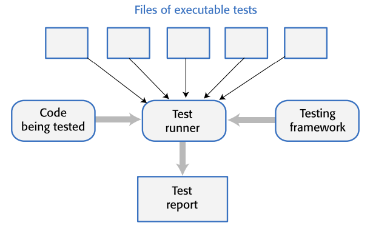

# TEÓRICA 9: Testagem de Software

Testagem de ‘software’ é o processo onde o programa nós executamos o programa com dados que simulam as entradas de um
utilizador comum. Após isso, observamos o comportamento para ver se o nosso programa faz o suposto.

- Caso passe nos testes, o programa está correto.
- Caso não passe, estamos de encontro com um 'bug'.

## Tipos de bugs

Existe dois tipos:

- Erros de programação: existem erros na implementação do pedido;
- Erros de compreensão: existe uma certa dificuldade em entender o pedido, ou desconhece alguns detalhes daquilo que ele
  é suposto fazer;

## Tipos de testes

Existem quatro tipos comuns de teste:

- Teste funcional:
    - Teste de sistema;
    - Teste de ferramentas;
- Teste de utilizador;
- Teste de performance;
- Teste de segurança;

## Automatação de testagem

** Fig.1: Diagrama de automatação de testagem **

Normalmente organiza-se a automatação de testes em três partes:

- Organização de testes;
- Execução de testes;
- Análise de resultados;

Nota: Na automatação de testes, a testagem de ferramentas e feita diretamente na API e não na ‘interface’ gráfica.

## Desenvolvimento guiado por testes

Desenvolvimento guiado por testes ou (Test Driven Development) é um processo de desenvolvimento de ‘software’ onde os
testes são escritos antes do código. O objetivo é escrever testes que falhem, e depois escrever o código para que os
testes passem.

Benefícios:

- Aumenta a confiança no código;
- Aumenta a qualidade do código;
- ‘Debugging’ mais fácil;

Desvantagens:

- Os programados ficam mais focados em passar nos testes do que em escrever código de qualidade e a estrutura do mesmo;

## Testes de segurança

Testes de segurança visam encontrar vulnerabilidades no ‘software’ que possam ser exploradas por um atacante.

### Testes de segurança baseados em risco

Testes de segurança baseados em risco (ou Risk Based Testing) é um processo onde os testes são baseados no risco de uma
aplicação.

#### Exemplos

Alguns exemplos são:

- Portas HTTP inutilizadas, porém abertas;
- Falhas de autenticação;
- ‘Cookies’ de acesso são revelados para um potencial atacante;
- Chaves de encriptação divulgadas para um potencial atacante;

## Revisões de código

Revisões de código envolvem uma ou mais pessoas que analisam o código de um programa para encontrar possiveís problemas.
Caso sejam encontrados erros, será responsabilidade do **desenvolvedor** resolvê-lo.

** Fig.2: Diagrama de revisão de código **

